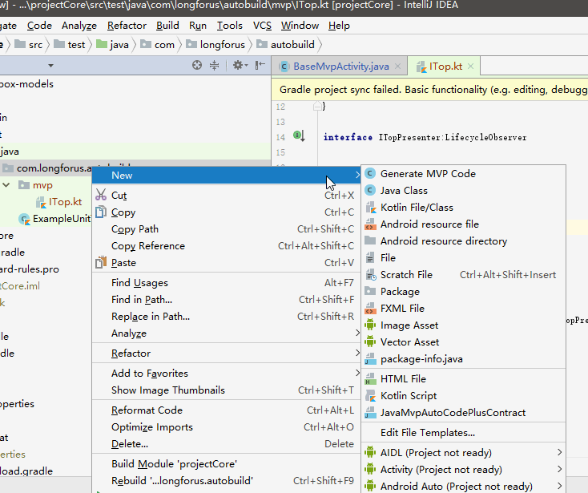
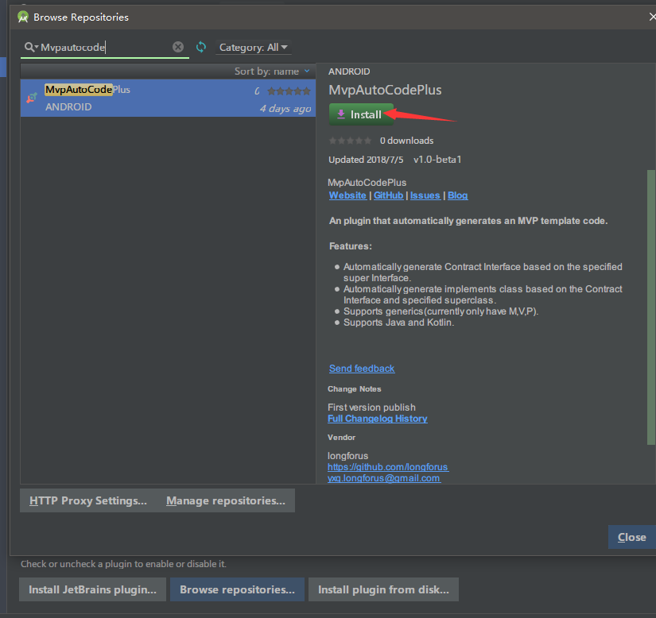
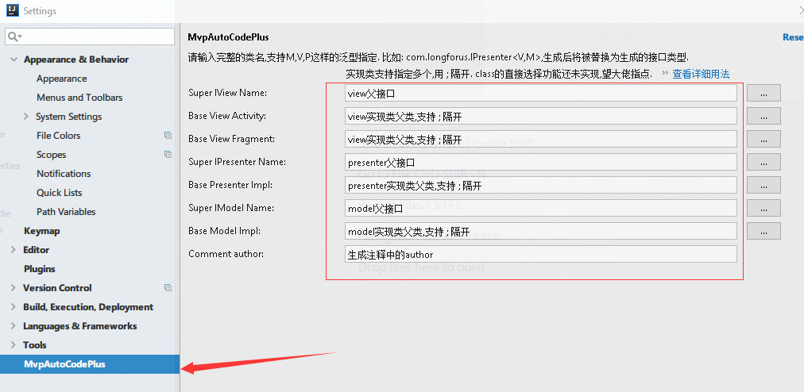
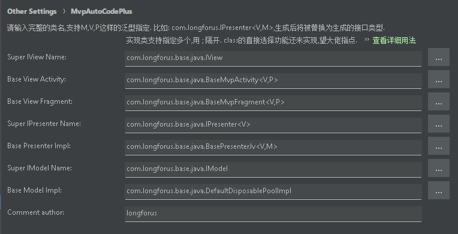
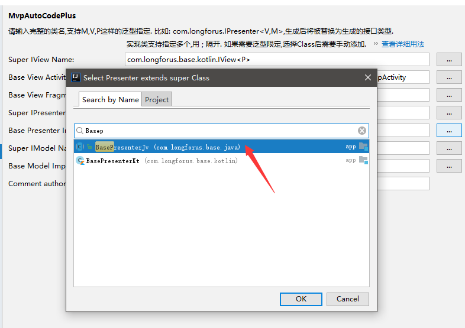
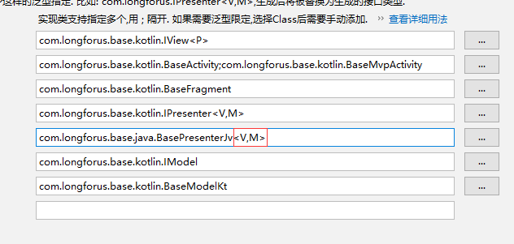
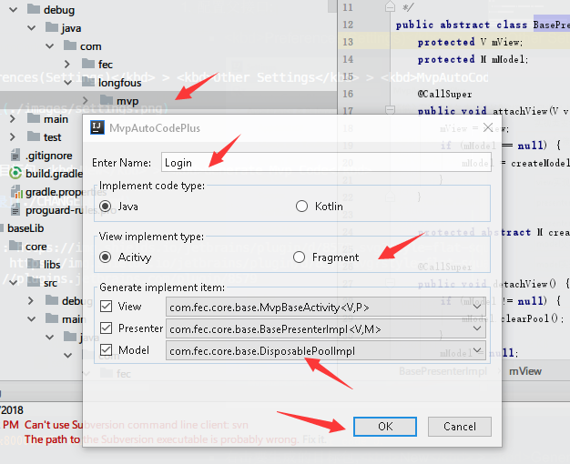

MvpAutoCodePlus
========================

[![Downloads][downloads-img]][plugin]

JetBrains IDEA/Android Studio MVP template code generation plug-in

## Character

- generate the MVP Contract interface class based on the specified parent interface.
- optionally generate an MVP implementation class based on the generated MVP Contract and the specified parent class, and add an abstract method default implementation.
- support Activity
- support fragments
- support the Presenter
- support the Model
- support Java and Kotlin languages

## IDE support:

- Android Studio(supported from 3.1(173.3727-173.*))
- IntelliJ IDEA
- IntelliJ IDEA Community Edition

## The installation

- **install using the IDE built-in plug-in system :**

  - <kbd>File</kbd> > <kbd>Preferences(Settings)</kbd> > <kbd>Plugins</kbd> > <kbd>Browse repositories...</kbd> > <kbd>search and find "MvpAutoCodePlus"</kbd> > <kbd>Install Plugin</kbd>

  

- **manual installation :**
  [`download the latest release of plug-in package `][latest-release] - > <kbd>File</kbd> ><kbd>Preferences(Settings)</kbd> > <kbd>Plugins</kbd> > <kbd>Install plugin from disk...</kbd>

 - **Restart the IDE**.

## Usage

1. Configure the parent interface:

  - <kbd>File</kbd> > <kbd>Preferences(Settings)</kbd> > <kbd>Other Settings</kbd> > <kbd>MvpAutoCodePlus</kbd> > 

  
  
  Based on [`this a set of Java interfaces`][my_interface_java] example configuration:
  
  
  
  Project in the Class has been V1.0beta2 support to choose, but if there are generic limit, generic or need to manually add, such as the choice of Class signature is: **com.longforus.Base.Java.BasePresenterJv<V extends IView, M extends IModel>**
  
  
  
  Manually add the following generic qualifier <V,M>:
  
  
  
  Global and current project modes are also supported, and the interfaces configured in global mode can be used in all projects. The interfaces configured in the current project only work in the current project, facilitating seamless switching between multiple different projects.
  
2. Generate:

  
  
- right click the target package to be generated,<kbd>New</kbd> > <kbd>Generate Mvp Code</kbd> (or select the package, press Alt+Insert). After generating the contract package, you can select the parent package of the contract package or contract.
- enter the code generated by the name, such as do the Login function, enter the Login and generate results is ILoginContract, LoginActivity, LoginPresenter, LoginModel
- choose the code implementation, Java or Kotlin
- select the implementation method of View,Activity or Fragment. If there are multiple configurations, select one of them, and remove the previous check box for the items you don't want to generate. If there are no superclasses of P and M implementation classes, the generated implementation classes of P and M will only implement the corresponding interface.
- Support for not generating Model interfaces and corresponding implementation classes from 1.1 onwards is more flexible.
- click Ok, wait a moment, and the code is generated. The generated package structure is as follows:

## About the parent interface

Only use my own currently use interface to development and testing, welcome to use their own interface for testing. If need [` I use interface `][my_interface], please download it in your own project.

## Problem

- if the parent interface and the parent class have a generic qualifier, you will need to manually enter the generic after selecting it, but it will be saved only once set and will not change frequently in the project.

- we haven't studied the layout file corresponding to the View, and it would be more convenient if we could also generate the default.

- other unknown problems, this plug-in is the first time for the author to develop the plug-in, which is completely from 0. The official documents are not very detailed, and the English level is even worse.

  [complete update history](./changelog.md)

if do not meet the requirements of your plugin. Can issue, also can fork to modify. Thank you for your attention.

[latest-release]: https://plugins.jetbrains.com/plugin/10907-mvpautocodeplus
[downloads-img]: https://img.shields.io/jetbrains/plugin/d/8579.svg?style=flat-square
[plugin]: https://plugins.jetbrains.com/plugin/10907-mvpautocodeplus
[my_interface]:https://github.com/longforus/MVPExample
[my_interface_java]:https://github.com/longforus/MVPExample/tree/master/app/src/main/java/com/longforus/base/java
